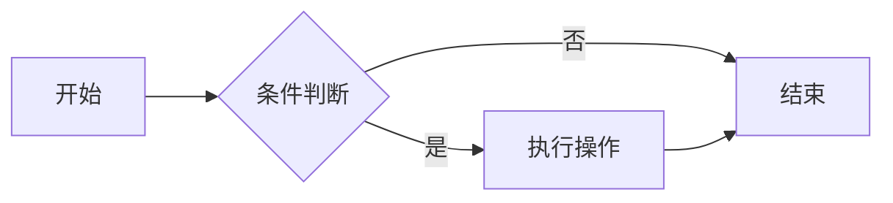

- [一、 语法速查表](#一-语法速查表)
- [二、 介绍](#二-介绍)
- [三、 基础语法](#三-基础语法)
  - [1. 标题](#1-标题)
  - [2. 段落与换行](#2-段落与换行)
  - [3. 强调](#3-强调)
  - [4. 列表](#4-列表)
    - [4.1 无序列表](#41-无序列表)
    - [4.2 有序列表](#42-有序列表)
    - [4.3 嵌套列表](#43-嵌套列表)
- [四、 块级元素](#四-块级元素)
  - [1. 引用块](#1-引用块)
  - [2. 代码块](#2-代码块)
    - [2.1 行内代码](#21-行内代码)
    - [2.2 多行代码块](#22-多行代码块)
  - [3. 分割线](#3-分割线)
  - [4. 表格](#4-表格)
- [五、 链接与图片](#五-链接与图片)
  - [1. 超链接](#1-超链接)
    - [1.1 行内式](#11-行内式)
    - [1.2 引用式](#12-引用式)
    - [1.3 自动链接](#13-自动链接)
  - [2. 图片](#2-图片)
    - [2.1 基本语法](#21-基本语法)
    - [2.2 带链接的图片](#22-带链接的图片)
- [六、 高级语法](#六-高级语法)
  - [1. 转义字符](#1-转义字符)
  - [2. 任务列表](#2-任务列表)
  - [3. 脚注](#3-脚注)
  - [4. 定义列表](#4-定义列表)
  - [5. 流程图 / Mermaid](#5-流程图--mermaid)
- [七、 Markdown 扩展与工具](#七-markdown-扩展与工具)
  - [1. 常见方言与差异](#1-常见方言与差异)
  - [2. 常用编辑器与渲染工具](#2-常用编辑器与渲染工具)
- [八、 写作最佳实践](#八-写作最佳实践)


# 一、 语法速查表

下表汇总了 Markdown 最常用的语法，方便随时查阅。每一项的详细用法见后续章节。

| 语法 | 写法 | 说明 |
|------|------|------|
| 标题 | `# 标题` | `#` 数量代表层级 |
| 粗体 | `**文字**` | |
| 斜体 | `*文字*` | |
| 删除线 | `~~文字~~` | GFM 扩展 |
| 有序列表 | `1. 文字` | |
| 无序列表 | `- 文字` | 也可用 `*` `+` |
| 任务列表 | `- [x] 文字` | GFM 扩展 |
| 引用 | `> 文字` | |
| 行内代码 | `` `代码` `` | |
| 代码块 | ` ```lang ` ... ` ``` ` | 指定语言可高亮 |
| 分割线 | `---` | |
| 链接 | `[文字](url)` | |
| 图片 | `` | |
| 表格 | `\| 列 \| 列 \|` | `:` 控制对齐 |
| 转义 | `\*` | |
| 脚注 | `[^1]` | |

# 二、 介绍

**Markdown** 是一种轻量级标记语言，它允许人们使用易读易写的纯文本格式编写文档，然后转换成结构化的 HTML（或其他格式）。

Markdown 诞生于 2004 年，由 John Gruber 和 Aaron Swartz 共同创建。它的核心设计理念只有一句话：

> Markdown 的目标是让写作者**专注内容本身**，而不是被排版分散精力。

在 Markdown 出现之前，写一篇排版精美的文章通常面临两个选择：

- **用 Word 等富文本编辑器**：所见即所得，但要频繁用鼠标点菜单调字体、调间距，写作思路被打断；
- **直接写 HTML**：结构精确，但标签冗长，`<p>`、`<strong>` 满屏都是，可读性极差。

Markdown 取了两者的折中——用极简的符号（如 `#`、`*`、`>`）表示结构，既保持纯文本的可读性，又能被渲染成漂亮的 HTML。

**Markdown vs HTML vs 富文本的对比：**

| 特性 | Markdown | HTML | 富文本（Word） |
|------|----------|------|----------------|
| 书写方式 | 纯文本符号 | 标签包裹 | 鼠标点选菜单 |
| 可读性 | 高（接近自然文本） | 低（标签冗长） | 不可见（二进制/样式） |
| 学习成本 | 低 | 中 | 低（但操作繁琐） |
| 版本控制友好 | 好（纯文本） | 好（纯文本） | 差（二进制） |
| 渲染目标 | HTML 等 | 浏览器 | 自身 |

> 正因为 Markdown 是纯文本，它天然适合 Git 版本控制，这也解释了为什么 README、技术文档、博客几乎都用 Markdown。

# 三、 基础语法

本节讲解日常写作中最常用的语法元素。每个语法都会用「**源码 → 渲染效果**」的方式对照展示。

## 1. 标题

使用 `#` 号表示标题，`#` 的数量代表标题层级，**`#` 和文字之间必须有一个空格**。

**源码：**

```markdown
# 一级标题
## 二级标题
### 三级标题
#### 四级标题
##### 五级标题
###### 六级标题
```

**渲染效果：** 对应 HTML 的 `<h1>` ~ `<h6>`。

> 一般文档从 `#`（一级标题）开始，一篇文档只应有一个一级标题。过深的标题层级（四、五、六级）会让结构混乱，建议最多用到三级。

## 2. 段落与换行

**段落**：在 Markdown 中，一个段落就是连续的一段文字。要**分段，需要用一个空行**隔开。

**换行**：在行末留两个空格再回车，或者使用 `<br>` 标签可以实现软换行（同一段落内换行）。

**源码：**

```markdown
这是第一段，这是第一段的第二行（行末有两个空格）  
这是第一段的第三行。

这是第二段（上面有一个空行）。
```

**渲染效果：**

这是第一段，这是第一段的第二行（行末有两个空格）  
这是第一段的第三行。

这是第二段（上面有一个空行）。

> 常见误区：很多人直接敲一个回车就以为是换段了，实际上**单个回车在 Markdown 中会被当作同一段落的软换行**，必须用空行才能分段。

## 3. 强调

使用 `*` 或 `_` 包裹文字来表示强调。

**源码：**

```markdown
*斜体文本*  或  _斜体文本_
**粗体文本**  或  __粗体文本__
***粗斜体文本***
~~删除线文本~~
```

**渲染效果：**

- *斜体文本*
- **粗体文本**
- ***粗斜体文本***
- ~~删除线文本~~

> 推荐统一使用 `*` 号，因为 `_` 在某些场景（如单词中间）可能不会被识别。

## 4. 列表

列表分为**有序列表**和**无序列表**，还可以**嵌套**形成多级结构。

### 4.1 无序列表

使用 `-`、`*` 或 `+` 作为标记，推荐统一用 `-`。

```markdown
- 苹果
- 香蕉
- 橘子
```

渲染效果：

- 苹果
- 香蕉
- 橘子

### 4.2 有序列表

使用数字加 `.` 表示，**数字的顺序不影响渲染结果**（会自动按出现顺序编号），但建议还是按顺序写。

```markdown
1. 第一步
2. 第二步
3. 第三步
```

渲染效果：

1. 第一步
2. 第二步
3. 第三步

### 4.3 嵌套列表

通过**缩进**（2 或 4 个空格）来表示层级关系。

```markdown
- 水果
  - 苹果
    - 红富士
    - 青苹果
  - 香蕉
- 蔬菜
  - 白菜
  - 萝卜
```

渲染效果：

- 水果
  - 苹果
    - 红富士
    - 青苹果
  - 香蕉
- 蔬菜
  - 白菜
  - 萝卜

嵌套列表的层级结构与缩进规则如下图所示，理解了缩进就掌握了嵌套的核心：


> 嵌套的关键是**缩进对齐**：同一层级的标记要对齐，子层级比父层级多缩进相同的空格数。混用 2 空格和 4 空格容易导致渲染错乱。

# 四、 块级元素

## 1. 引用块

使用 `>` 表示引用，常用于强调、备注或引用他人话语。**多个 `>` 可以嵌套**。

**源码：**

```markdown
> 这是一段引用。
>
> 引用内可以分段。

> 嵌套引用：
>> 这是二级嵌套引用。
```

**渲染效果：**

> 这是一段引用。
>
> 引用内可以分段。

> 嵌套引用：
>> 这是二级嵌套引用。

引用块内还可以包含其他 Markdown 元素，如列表、代码块等：

```markdown
> 引用内的列表：
> - 第一项
> - 第二项
```

## 2. 代码块

### 2.1 行内代码

用反引号 `` ` `` 包裹，用于在句子中突出显示命令、变量名、文件名等。

```markdown
使用 `git status` 查看仓库状态。
```

渲染效果：使用 `git status` 查看仓库状态。

### 2.2 多行代码块

用三个反引号 ` ``` ` 包裹，可以在开头反引号后**指定语言**以启用语法高亮。

````markdown
```java
public class HelloWorld {
    public static void main(String[] args) {
        System.out.println("Hello, Markdown!");
    }
}
```
````

渲染效果（带 Java 语法高亮）：

```java
public class HelloWorld {
    public static void main(String[] args) {
        System.out.println("Hello, Markdown!");
    }
}
```

> 如果代码内容本身包含反引号，可以用更多个反引号作为定界符，如 ` ```` ` 包裹含有三个反引号的代码块。

## 3. 分割线

使用三个或以上的 `*`、`-` 或 `_` 可以创建分割线。推荐使用 `---`。

```markdown
---
```

渲染效果：

---

## 4. 表格

使用 `|` 分隔列，用 `---` 分隔表头和表体。冒号 `:` 可以控制对齐方式。

**源码：**

```markdown
| 左对齐 | 居中对齐 | 右对齐 |
|:-------|:--------:|-------:|
| 单元格 |  单元格  | 单元格 |
| 左     |   中     |     右 |
```

**渲染效果：**

| 左对齐 | 居中对齐 | 右对齐 |
|:-------|:--------:|-------:|
| 单元格 |  单元格  | 单元格 |
| 左     |   中     |     右 |

> 对齐规则：`:---` 左对齐，`:---:` 居中对齐，`---:` 右对齐。不写冒号则默认左对齐。

# 五、 链接与图片

## 1. 超链接

### 1.1 行内式

最常用的写法，`[显示文字](链接地址)`。

```markdown
[Google](https://www.google.com)
[带提示的链接](https://www.google.com "鼠标悬停提示")
```

渲染效果：[Google](https://www.google.com)

### 1.2 引用式

适合同一链接在文中多次出现的情况，先定义引用，再使用。

```markdown
我经常使用 [Google][1] 搜索，也常用 [GitHub][gh] 托管代码。

[1]: https://www.google.com
[gh]: https://github.com
```

> 引用式的好处是**链接统一管理**，修改时只需改定义处，不必逐个替换。

### 1.3 自动链接

直接写 URL 或邮箱，部分渲染器会自动转为可点击链接。

```markdown
https://www.google.com
<https://www.google.com>
```

## 2. 图片

### 2.1 基本语法

图片语法和链接几乎一样，只是前面多了一个 `!`：``。

```markdown

```

> `!` 是 image 的关键标识，**漏掉 `!` 就变成了普通链接**，这是新手最常犯的错误。

### 2.2 带链接的图片

把图片语法嵌套在链接语法里即可实现「点击图片跳转」。

```markdown
[](https://markdown.com.cn)
```

# 六、 高级语法

## 1. 转义字符

Markdown 中一些符号有特殊含义（如 `*`、`#`、`>`），如果想让它们**显示为普通字符**，用反斜杠 `\` 转义。

```markdown
\* 这不是斜体 \*
\# 这不是标题
```

渲染效果：\* 这不是斜体 \*，\# 这不是标题

需要转义的特殊字符包括：

```
\  `  *  _  {}  []  ()  #  +  -  .  !  |
```

## 2. 任务列表

使用 `- [ ]` 和 `- [x]` 创建带勾选框的任务列表，常用于 Todo 清单。

```markdown
- [x] 已完成的任务
- [ ] 未完成的任务
- [ ] 另一个未完成任务
```

渲染效果：

- [x] 已完成的任务
- [ ] 未完成的任务
- [ ] 另一个未完成任务

## 3. 脚注

用于添加补充说明，正文处用 `[^id]` 标记，文末定义脚注内容。

```markdown
这里有一个脚注[^1]。

[^1]: 这是脚注的具体内容。
```

> 脚注的编号会自动生成，读者点击标记可跳转到文末的脚注内容。

## 4. 定义列表

部分方言（如 PHP Markdown Extra）支持定义列表：

```markdown
术语 A
:   术语 A 的定义。

术语 B
:   术语 B 的定义。
```

> 注意：定义列表不是所有渲染器都支持，CommonMark 标准中不包含此语法，使用前需确认目标平台支持。

## 5. 流程图 / Mermaid

许多平台（GitHub、GitLab、Typora 等）支持 Mermaid 语法，可以直接在代码块中绘制流程图、时序图等。

````markdown

````

渲染效果（支持 Mermaid 的平台会显示为流程图）：


# 七、 Markdown 扩展与工具

## 1. 常见方言与差异

原始 Markdown（John Gruber 版本）功能有限，社区在此基础上扩展出多种「方言」：

| 方言 | 全称 | 特点 |
|------|------|------|
| **CommonMark** | CommonMark | 严格标准化版本，明确定义了边界行为 |
| **GFM** | GitHub Flavored Markdown | GitHub 扩展，支持表格、任务列表、删除线、自动链接、代码围栏 |
| **MDX** | Markdown + JSX | 在 Markdown 中嵌入 React 组件 |

> 不同平台的 Markdown 渲染结果可能不同，写文档前最好**了解目标平台支持哪种方言**。比如表格和任务列表是 GFM 扩展，原始 Markdown 并不支持。

## 2. 常用编辑器与渲染工具

| 工具 | 类型 | 特点 |
|------|------|------|
| **Typora** | 所见即所得编辑器 | 所写即所得，沉浸式写作 |
| **VS Code** | 代码编辑器 + 插件 | 配合 Markdown All in One 等插件 |
| **Obsidian** | 知识管理 | 支持双链、图谱，适合做笔记库 |
| **MarkText** | 开源编辑器 | 类 Typora 体验，免费 |
| **GitHub/GitLab** | 在线渲染 | 原生支持 GFM |

# 八、 写作最佳实践

**结构清晰**

- 一篇文档只用一个一级标题作为标题
- 标题层级**逐级递进**，不要跳级（如从 `#` 直接跳到 `###`）
- 标题前后留空行

**格式规范**

- `#`、`-` 等标记符后**加一个空格**
- 列表嵌套缩进统一用 2 或 4 个空格，**不要混用**
- 代码块注明语言以启用高亮

**可读性**

- 段落之间用空行分隔
- 表格不要过宽，列数控制在 4~5 列以内
- 图片要有替代文字（`![描述]`），方便图片加载失败时理解内容

**兼容性**

- 优先使用 CommonMark/GFM 通用语法
- 使用扩展语法前确认目标平台是否支持
- 避免过度依赖特定渲染器的私有特性
